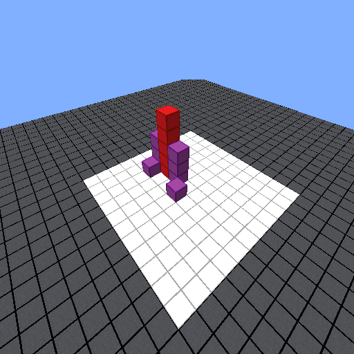

# Introduction
This repository contains the code for *MM-IGLU: Multi-Modal Interactive Grounded Language Understanding* accepted at the [LREC-COLING 2024](https://lrec-coling-2024.org/) conference, published by *Claudiu Daniel Hromei* (Tor Vergata, University of Rome), *Daniele Margiotta* (Tor Vergata, University of Rome), *Danilo Croce* (Tor Vergata, University of Rome) and *Roberto Basili* (Tor Vergata, University of Rome). The paper will be available [here]().

*MM-IGLU* is a Multi-Modal dataset for Interactive Grounded Language Understanding, that expands the resource released during the [IGLU](https://github.com/microsoft/iglu-datasets) competition. While the competition was text-only, we expanded this resource by generating a 3d image for each representation of the world.

Given a 3d world and a command in natural language from a Human Architect, the task of a Robotic Builder is to assess if the command is executable based on the world and then execute it or, if more information is needed, to ask more questions. We report here an example of the image:



and a command like "*Break the green blocks*". If, like in this case, there are no green blocks, the Robotic Builder should answer back "*There are no break blocks, which block should I break?*". For the same image, if the command is "*Break the red blocks*", in this case the Builder should understand that there are red blocks in the environment and should answer "*I can execute it*", confirming the feasibility of the command.

Moreover, we constructed a textual map description of the image, free of hallucinations, that describes all the blocks present therein. As an example, for the image above, the description looks like:  
    
    There are no blue blocks, no yellow blocks, no green blocks, no orange blocks, eight purple blocks, four of which are on the ground, six red blocks, one of which is on the ground

This description functions as a surrogate for the visual clue and enables the usage of text-only models for solving this task. For this reason, we developed a model (based on the BART transformer) for solving the task based only on the textual command and the textual map description that answers back either with the confirmation or a relevant question.

Finally, we developed a further multi-modal model based on [LLaVA](https://github.com/haotian-liu/LLaVA) for solving the task exploiting both the command and the 3d image. It couples a [CLIP](https://github.com/openai/CLIP) model for handling the images with a Language Model for generating the answers. This model achieved the best performance when coupled with the LLaMA-2-chat-13b model.

In the rest of this README file, you will find some more information about the dataset, how to train the models and how to make the inference by using them.


## Dataset
The dataset is provided in the `data` folder. In `data/iglu_dataset` you can find our split into train/dev/test files. Each row is made of a unique ID, the path to the 3d image, the description in natural language, the command, a flag to mark if the command is clear or ambiguous and the most relevant question or the answer "*I can execute it*", and the path to the json file containing the information about the world (such as the blocks, the positions and the colors). Here we show an example:

| ID 	| World Path 	| Image path 	| Environment Description 	| Command 	| Is command clear 	| Expected output 	|
|---	|---	|---	|---	|---	|---	|---	|
| CQ-game-3954 	| ./data/iwp/33-c135/step-6 	| ./data/images/CQ-game-3954.png 	| there are no blue blocks, no yellow blocks, no green blocks, no orange blocks, nine purple blocks, no red blocks 	| Facing North place a column of four purple blocks below the rightmost purple block. You should have a Pi shape. 	| Yes 	| I can execute it. 	|
| CQ-game-4972 	| ./data/iwp/1-c96/step-14 	| ./data/images/CQ-game-4972.png 	| there are no blue blocks, two yellow blocks, two of which are on the ground, four green blocks, no orange blocks, four purple blocks, four red blocks, four of which are on the ground 	| Place 2 blue block extensions on each of the two lower blocks for each of the 3 block corners. 	| No 	| Where on each of the two lower blocks should two blue block extensions be placed? 	|


# Install Required Lib
If you are not using Linux, do *NOT* proceed, we intend this software to run on Linux architecture only.  
We invite you to install the LLaVA dependencies as follows, since our code is based on the 1.0.2 version of LLaVA:

0. Clone this repository
```Shell
git pull https://github.com/crux82/MM-IGLU
cd mm_iglu
```

1. Create Environment and Install Packages
```Shell
conda create --name mm_iglu python=3.10 -y 
conda activate mm_iglu
pip install --upgrade pip  # enable PEP 660 support
pip install -e .
```

2. Install additional packages for training cases
```Shell
pip install ninja
pip install flash-attn --no-build-isolation
```

3. Install this specific version of Torch as currently there are some conflicts with flash-attention:
```Shell
pip install torch==2.0.1+cu118 torchvision==0.15.2+cu118 torchaudio==2.0.2+cu118 --extra-index-url https://download.pytorch.org/whl/cu118
```

### Upgrade to latest code base

```Shell
git pull
pip uninstall transformers
pip install -e .
```


# DEMO: How to use
You can open this [Notebook](demo.ipynb) in Google Colab to use the model. It will load our model from HuggingFace and make a simple test on 2 commands paired with an image.

We release our Multi-Modal model on HuggingFace, you can find:
- [The full model](https://huggingface.co/sag-uniroma2/llava-Llama-2-chat-13b-hf-iglu-merged), where the LoRA modules have been merged with the original model. You can load this model only to use it on your data, or add another LoRA module and fine-tune it on your downstream task. You can find the script we used to merge the weights [here](scripts/merge_lora_weights.py).
- [The LoRA adapters only](https://huggingface.co/sag-uniroma2/llava-Llama-2-chat-13b-hf-iglu-adapters), so that you can load the original LLaMA2chat-13b model and the CLIP vision model separately for fast testing.

## Launch a Gradio Web Server.
You can use [these instructions](launch_gradio.md) to launch a Gradio Web Server for testing our models from an interface, where you can upload your images (of a Minecraft-like world) and give commands to the model.

# How to train
You can run the `finetune_llama2chat_lora.sh` script that will fine-tune a LLaMA model using the LLaVA architecture able to generate questions for the given commands. You can change the input parameters to train a different model (`model_name_or_path`) or on a different task (change the `data_path` for files containing *classification* or *generation* as you like).

# Evaluation
You can run the `test_llama2chat_lora.sh` script to generate the predictions that the model produces. This were used in the paper to evaluate the model and produced the following evaluation table, where:
- The Train task of: 
  - "*Generation*" evaluates the ability of the model to produce a question if the command is not clear or the answer "*I can execute it*" when it is clear. 
  - "*Multi-Task*" evaluates the same ability as above, but the model is trained on the union of "*Generation*" and "*Classification*", i.e. to asses whether a command is executable or not (*Yes/No* answers).
- The Type:
  - Text-only refers to training the model on textual data only
  - Multi-Modal refers to training the model with images and texts.

If you want more details, please consult the paper, where you can find more metrics.

| **Model name**  | **Type**    | **Train task** | **F1 Pos**  | **F1 Neg**  | **Macro\-F1** |
|-----------------|-------------|----------------|-------------|-------------|---------------|
| BART\-IGLU      | Text-Only   | Generation     | 93\.76%     | 7\.14%      | 50\.45%       |
| LLaMA2Chat\-13b | Multi-Modal | Generation     | 93\.90%     | 45\.26%     | 69\.58%       |
| LLaMA2Chat\-13b | Multi-Modal | Multi-Task     | **93\.95%** | **47\.89%** | **70\.92%**   |


# Citation
```
@inproceedings{hromei2024mmiglu,
  author       = {Claudiu Daniel Hromei and
                  Daniele Margiotta and
                  Danilo Croce and
                  Roberto Basili},
  title        = {MM-IGLU: Multi-Modal Interactive Grounded Language Understanding},
  booktitle    = {???},
  publisher    = {???},
  year         = {2024},
  month        = {???},
  address      = {???}
}
```